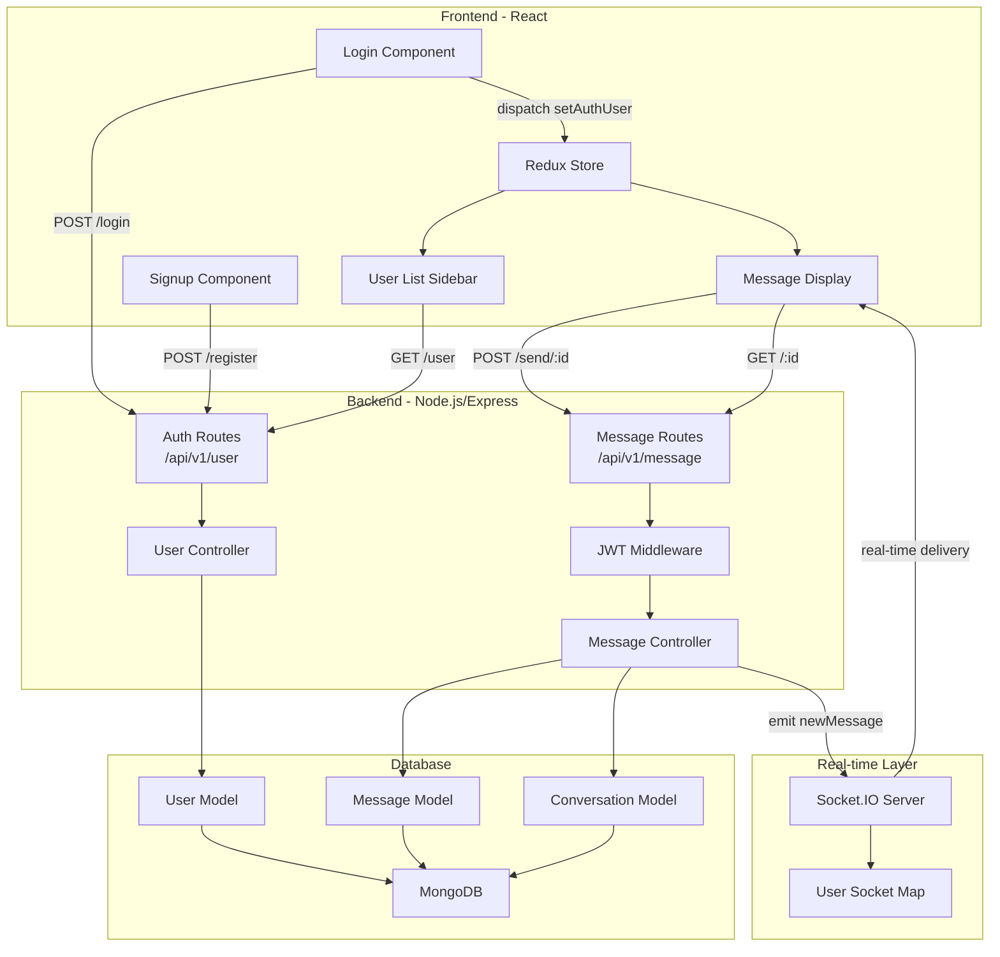
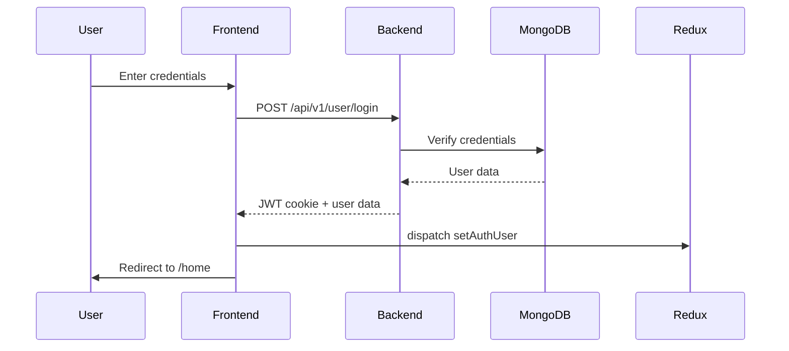
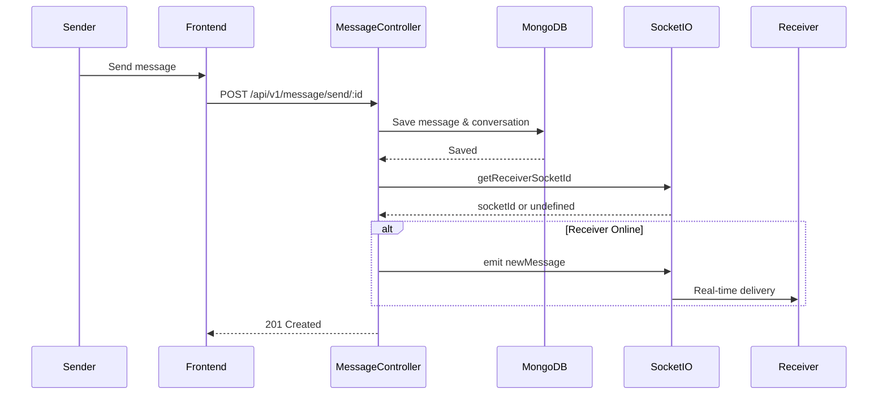

### Project Overview

**Chatterbox** is a full-stack real-time chat application featuring user authentication, instant messaging, and online status tracking.<cite></cite>

### Architecture Flowchart



### Authentication Flow



### Real-time Messaging Flow



### Tech Stack

**Frontend:**
- React with Hooks (useState, useEffect, useSelector, useDispatch)
- Redux for state management
- React Router for navigation
- Axios for HTTP requests
- Socket.IO client for real-time communication
- React Hot Toast for notifications chatterbox:1-6 chatterbox:1-9 

**Backend:**
- Node.js with Express
- MongoDB with Mongoose ODM
- Socket.IO for WebSocket connections
- JWT for authentication
- bcrypt for password hashing chatterbox:1-13 

### Key Features

1. **User Authentication**: Secure signup/login with JWT tokens stored in HTTP-only cookies chatterbox:32-37 
2. **Real-time Messaging**: Instant message delivery using Socket.IO chatterbox:19-26 
3. **User Search**: Filter users by name to start conversations chatterbox:31-40 
4. **Online Status**: Track which users are currently online chatterbox:22-26 
5. **Conversation History**: Persistent message storage with MongoDB chatterbox:3-14 

### Installation & Setup

```bash
# Clone repository
git clone https://github.com/dhruv871saini/chatterbox.git

# Install backend dependencies
cd backend
npm install

# Install frontend dependencies
cd ../frontends
npm install

# Start backend server
cd ../backend
npm start

# Start frontend (in separate terminal)
cd ../frontends
npm start
``` 

### API Endpoints

**Authentication:**
- `POST /api/v1/user/register` - User registration
- `POST /api/v1/user/login` - User login
- `GET /api/v1/user/logout` - User logout
- `GET /api/v1/user/` - Get all users

**Messaging:**
- `POST /api/v1/message/send/:id` - Send message to user
- `GET /api/v1/message/:id` - Get conversation with user chatterbox:32-32 chatterbox:25-25 chatterbox:18-18 chatterbox:13-13 

### Data Models

**User Model**: Stores user credentials and profile information<cite></cite>

**Message Model**: Individual message with sender, receiver, and content chatterbox:3-22 

**Conversation Model**: Links two users with their message history chatterbox:3-14 
